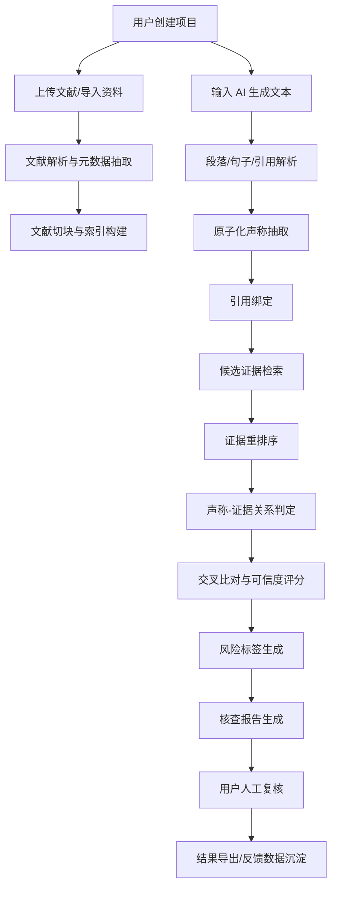
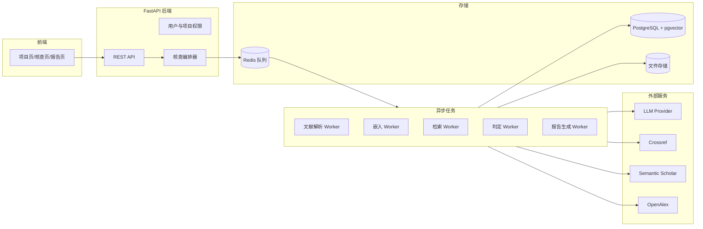

# AI 输出事实核查与可信度评估系统 PRD

> 文档版本：v1.0  
> 面向开发：Codex / Cursor / 本地工程开发  
> 产品定位：不修改底层大模型，仅在 AI 输出层进行“声称拆解—证据检索—文献比对—可信度评估—报告输出”。  
> 核心场景：用户将 AI 生成的论文段落、综述、研究背景、方法描述、文献总结等内容输入系统后，系统判断其中是否存在幻觉、无依据陈述、与引用文献不一致、张冠李戴、过度概括、胡编数据或伪造文献等问题。

---

## 1. 背景与问题定义

### 1.1 背景

在论文写作、文献综述和科研辅助场景中，AI 经常能够生成结构完整、语言流畅的段落，但输出内容可能存在以下问题：

1. **事实性幻觉**：AI 将不存在的研究结论、数据、方法或实验结果写成确定事实。
2. **文献归因错误**：AI 声称“某文献提出/证明/发现了某结论”，但原文献并未表达该内容。
3. **引用错配**：段落中引用了 A 文献，但实际支撑该观点的是 B 文献，或没有任何文献支撑。
4. **过度概括**：单篇文献中的有限结论被扩展为领域共识。
5. **数值与指标错误**：AI 编造准确率、样本量、年份、参数、实验结果等。
6. **综述不相关**：生成内容看似与主题相关，但与用户指定文献、课题方向或研究问题并不匹配。
7. **伪造参考文献**：生成不存在的 DOI、期刊、作者组合或题名。

因此，本系统目标不是替代研究者做最终学术判断，而是作为**论文写作前的事实风险扫描器**，帮助用户定位高风险句子、查看证据来源、判断可用性，并给出可信度标签。

### 1.2 产品目标

构建一套面向论文写作与文献综述场景的 AI 输出事实核查系统：

- 将 AI 输出内容拆解为可验证的最小事实声称；
- 从用户上传的 PDF、DOCX、BibTeX、DOI、文献库或外部学术元数据源中检索证据；
- 对声称与证据之间的关系进行判定：支持、反驳、部分支持、证据不足、无法验证、引用错配；
- 对每条声称输出可信度分数、风险等级、证据片段、页码、来源和解释；
- 最终生成适合论文写作修改的 Markdown / JSON / HTML 报告。

### 1.3 产品边界

#### 做什么

- 核查 AI 生成文本中的事实性声称；
- 核查生成内容是否被指定文献支持；
- 核查引用是否真实、是否与原文内容一致；
- 识别论文写作中的幻觉风险；
- 输出证据链、可信度、风险说明和修改建议。

#### 不做什么

- 不修改底层大模型；
- 不保证给出绝对真理，只给出“基于当前证据库的可信度判断”；
- 不自动替用户完成最终论文定稿；
- 不在无证据情况下编造“可能的文献依据”；
- 不把 AI 模型自身知识当作证据；
- 不将“语言通顺”误判为“事实可靠”。

---

## 2. 用户与典型场景

### 2.1 目标用户

| 用户类型 | 需求 | 主要痛点 |
|---|---|---|
| 本科/硕士/博士学生 | 检查 AI 生成的综述、研究背景、论文段落 | 担心 AI 胡编文献、结论不对应 |
| 科研写作者 | 检查综述段落是否忠实于文献 | 文献多，人工逐句核对成本高 |
| 导师/审稿辅助人员 | 快速识别学生论文中的可疑引用 | 难以判断哪些句子最值得复查 |
| 学术工具开发者 | 集成到写作工作流 | 需要结构化 API 与可追溯结果 |

### 2.2 核心使用场景

#### 场景 A：AI 生成综述段落核查

用户输入：

- 一段 AI 生成的文献综述；
- 上传 10 篇相关 PDF；
- 选择“严格论文模式”。

系统输出：

- 每条声称是否被文献支持；
- 哪些句子没有证据；
- 哪些句子把 A 文献的观点错误归因给 B 文献；
- 哪些句子属于“过度概括”；
- 可导出的核查报告。

#### 场景 B：指定文献归因核查

用户输入：

- “请检查这段话是否真正来自我引用的这 3 篇文献”；
- AI 生成的段落中包含 `[1][2][3]` 或作者年份引用。

系统输出：

- 每个引用编号对应的文献；
- 每个带引用的声称是否被对应文献支持；
- 如果不支持，标记为“引用错配”或“文献无关”；
- 给出应删除、改写或重新找证据的建议。

#### 场景 C：参考文献真实性核查

用户输入：

- AI 生成的参考文献列表；
- 可选 DOI / BibTeX / EndNote 文件。

系统输出：

- 文献是否真实存在；
- 题名、作者、年份、期刊、DOI 是否匹配；
- 是否疑似伪造引用；
- 是否存在同名不同文献或 DOI 错误。

#### 场景 D：论文段落提交前风险扫描

用户输入：

- 论文草稿中的“研究背景、相关工作、方法对比、实验结果分析”等章节；
- 已整理好的资料库。

系统输出：

- 按段落的风险热力图；
- 高风险声称清单；
- 每个风险点的证据缺口；
- “可保留 / 需补证据 / 建议删除 / 建议弱化表述”的处理意见。

---

## 3. 核心概念定义

### 3.1 声称 Claim

声称是指文本中可被证据支持或反驳的最小事实单元。系统不以整段为单位判断，而是将文本拆成原子化声称。

示例：

原句：

> Zhang 等提出了一种基于 Transformer 的负荷预测模型，并在真实工业数据集上将 MAE 降低了 15%。

可拆为：

1. Zhang 等提出了一种基于 Transformer 的负荷预测模型；
2. 该模型用于负荷预测；
3. 实验使用真实工业数据集；
4. MAE 降低了 15%。

### 3.2 证据 Evidence

证据是从可追溯来源中抽取的文本、表格、图题、公式说明、摘要、结论或元数据片段。每条证据必须包含来源定位信息。

证据字段必须包括：

- 文献题名；
- 作者；
- 年份；
- DOI / arXiv ID / URL / 本地文件 ID；
- 页码；
- 段落 / chunk ID；
- 原文片段；
- 与声称的相关度；
- 与声称的语义关系。

### 3.3 判定标签 Verdict

系统采用面向论文核查的扩展标签体系：

| 标签 | 含义 | 使用条件 |
|---|---|---|
| `SUPPORTED` | 被证据支持 | 证据能够直接或合理推导出该声称 |
| `PARTIALLY_SUPPORTED` | 部分支持 | 证据支持部分内容，但范围、数值、对象或强度不完全一致 |
| `REFUTED` | 被证据反驳 | 证据明确说明与声称相反的内容 |
| `INSUFFICIENT_EVIDENCE` | 证据不足 | 检索到相关文献，但无法支持或反驳 |
| `CITATION_MISMATCH` | 引用错配 | 声称本身可能正确，但当前引用文献不支持它 |
| `SOURCE_IRRELEVANT` | 与所属文献无关 | 声称与指定文献主题、方法或结论无明显关系 |
| `FABRICATED_REFERENCE` | 疑似伪造文献 | 文献元数据无法匹配，或 DOI/题名/作者组合异常 |
| `NOT_VERIFIABLE` | 不适合自动核查 | 主观评价、未来预测、写作性表述等 |

### 3.4 可信度 Confidence

可信度是系统对“当前判定是否可靠”的数值评分，范围为 0–100。可信度不是声称真实性本身，而是系统基于证据质量、相关度、一致性和来源权威性给出的判断可靠程度。

### 3.5 风险等级 Risk Level

| 风险等级 | 分数范围 | 说明 |
|---|---:|---|
| 低风险 | 80–100 | 证据充分，可基本保留 |
| 中风险 | 60–79 | 有一定依据，但建议补充文献或弱化表述 |
| 高风险 | 30–59 | 支撑不足、归因可能错误，论文中不应直接使用 |
| 严重风险 | 0–29 | 可能是幻觉、伪造引用、严重反向表述或胡编数据 |

---

## 4. 功能需求

### 4.1 功能优先级

| 优先级 | 说明 |
|---|---|
| P0 | MVP 必须实现，否则产品不可用 |
| P1 | 首版建议实现，显著增强论文场景可用性 |
| P2 | 后续增强功能 |

### 4.2 功能列表

#### FR-001 项目创建与资料管理 P0

用户可以创建一个核查项目，并上传该项目的文献资料。

输入类型：

- PDF；
- DOCX；
- TXT / Markdown；
- BibTeX；
- DOI 列表；
- 参考文献文本；
- AI 生成段落。

系统行为：

1. 保存原始文件；
2. 抽取文献元数据；
3. 抽取正文、摘要、标题、作者、年份、参考文献、表格、图题；
4. 切分为带页码的 chunks；
5. 建立全文索引与向量索引。

验收标准：

- 上传 PDF 后能够解析出文本与页码；
- 每个 chunk 可以追溯到原始文献和页码；
- 解析失败时给出明确错误信息；
- 支持同一项目内多篇文献。

#### FR-002 AI 输出文本导入 P0

用户可以粘贴 AI 生成内容，或上传 Markdown / DOCX 文档。

字段：

- `input_text`：待核查文本；
- `section_type`：章节类型，如研究背景、相关工作、方法、实验结果、结论；
- `verification_mode`：核查模式；
- `citation_style`：引用格式，如数字型、作者年份型、无引用；
- `strictness`：严格程度。

验收标准：

- 系统能识别段落、句子、引用编号；
- 系统能保留原文位置，方便高亮展示；
- 支持中文、英文以及中英混合文本。

#### FR-003 声称抽取 P0

系统将输入文本拆分为原子化声称，并标注声称类型。

声称类型：

| 类型 | 示例 | 核查重点 |
|---|---|---|
| `DEFINITION` | 某概念被定义为…… | 定义是否来自可靠来源 |
| `METHOD` | 某文献提出了某方法 | 文献是否真的提出 |
| `RESULT` | 实验结果表明…… | 结果是否在原文出现 |
| `NUMERIC` | 准确率提高 15% | 数值是否一致 |
| `COMPARATIVE` | A 优于 B | 比较对象和条件是否一致 |
| `CAUSAL` | A 导致 B | 是否存在因果证据 |
| `CONSENSUS` | 现有研究普遍认为…… | 是否有多篇文献支持 |
| `CITATION_ATTRIBUTION` | Smith 等指出…… | 归因是否准确 |
| `BACKGROUND` | 行业背景事实 | 是否需要外部来源 |
| `NON_CHECKABLE` | 本文将重点研究…… | 不进入事实核查 |

输出格式：

```json
{
  "claim_id": "clm_001",
  "original_sentence": "Zhang 等提出了一种基于 Transformer 的负荷预测模型，并将 MAE 降低了 15%。",
  "atomic_claim": "Zhang 等提出的模型将 MAE 降低了 15%。",
  "claim_type": "NUMERIC",
  "citation_refs": ["Zhang2022"],
  "location": {
    "paragraph_index": 2,
    "sentence_index": 1,
    "char_start": 28,
    "char_end": 61
  },
  "check_required": true
}
```

验收标准：

- 一句话中包含多个事实时必须拆开；
- 主观表达不强制核查；
- 带引用的声称必须绑定引用；
- 不允许把整段话直接作为一个声称。

#### FR-004 引用绑定与文献定位 P0

系统识别文本中的引用，并将其绑定到项目文献库中的具体文献。

支持格式：

- `[1]`、`[2-4]`；
- `(Zhang et al., 2022)`；
- `张三等（2023）`；
- 参考文献列表中的题名 / DOI；
- 用户手动指定引用对应关系。

系统行为：

1. 解析引用标记；
2. 匹配上传文献元数据；
3. 如果匹配失败，调用外部元数据源进行 DOI / 题名 / 作者校验；
4. 返回引用绑定置信度；
5. 标记未匹配或疑似伪造文献。

验收标准：

- 能区分“文献存在但不支持声称”和“文献本身不存在”；
- 引用匹配失败不能静默跳过；
- 同一引用编号必须有唯一可追溯来源。

#### FR-005 证据检索 P0

系统为每条声称检索候选证据。

检索优先级：

1. 明确引用的文献；
2. 用户上传的项目文献库；
3. 用户指定外部来源；
4. 开放学术元数据源；
5. 普通网页搜索，默认关闭。

检索策略：

- BM25 关键词检索；
- 向量语义检索；
- DOI / 作者 / 年份精确检索；
- 表格标题、图题、摘要、结论单独加权；
- 对数值型声称增加数字和单位匹配；
- 对引用归因型声称优先检索被引用文献全文。

候选证据数量：

- 默认每条声称召回 `top_k=12` 个候选 chunk；
- 重排序后保留 `top_n=5` 个证据进入判定；
- 对 `CONSENSUS` 类型声称，至少检索 3 篇不同文献。

验收标准：

- 证据必须包含页码或可定位位置；
- 如果没有检索到证据，应返回 `INSUFFICIENT_EVIDENCE`，不能用模型知识补充；
- 对带引用声称，若引用文献中没有证据，但其他文献有证据，应标为 `CITATION_MISMATCH`，不能直接标为完全支持。

#### FR-006 声称—证据关系判定 P0

系统判断每条声称与候选证据之间的关系。

判定维度：

| 维度 | 含义 |
|---|---|
| 语义相关度 | 证据是否讨论同一对象 |
| 支持强度 | 证据是否能够直接支持声称 |
| 反驳强度 | 证据是否与声称矛盾 |
| 数值一致性 | 数据、比例、年份、单位是否一致 |
| 范围一致性 | 证据是否被过度外推 |
| 引用一致性 | 当前引用是否真正支撑该声称 |
| 来源可信度 | 来源类型、元数据完整性、文献质量 |

判定输出：

```json
{
  "claim_id": "clm_001",
  "evidence_id": "evd_003",
  "relation": "PARTIALLY_SUPPORTED",
  "entailment_score": 0.68,
  "relevance_score": 0.82,
  "numeric_match": false,
  "explanation": "证据支持该文献使用 Transformer 进行负荷预测，但没有出现 MAE 降低 15% 的数值。",
  "risk_flags": ["UNSUPPORTED_NUMERIC_VALUE"]
}
```

验收标准：

- 判定必须基于证据文本；
- 不能只依据相似度给出支持结论；
- 每条支持/反驳结论都必须能回溯到证据片段；
- 数值、年份、单位必须单独校验。

#### FR-007 交叉比对与综合判定 P0

系统将多个证据关系合并为每条声称的最终判定。

聚合规则：

1. 如果指定引用文献直接支持，则优先输出 `SUPPORTED`；
2. 如果指定引用文献不支持，但其他文献支持，输出 `CITATION_MISMATCH`；
3. 如果有强反驳证据，优先输出 `REFUTED` 或 `CONFLICTING_EVIDENCE`；
4. 如果只有弱相关证据，输出 `INSUFFICIENT_EVIDENCE`；
5. 如果只支持部分内容，输出 `PARTIALLY_SUPPORTED`；
6. 对“普遍认为”“广泛研究表明”等共识性表达，必须至少有多篇独立文献支持，否则输出 `OVERGENERALIZATION_RISK`。

验收标准：

- 每条声称只输出一个主标签；
- 可同时输出多个风险 flags；
- 结果中必须展示“为什么不是完全支持”。

#### FR-008 可信度评分 P0

系统为每条声称计算可信度分数。

基础公式：

```text
confidence =
  0.30 * evidence_relevance_score +
  0.30 * entailment_score +
  0.15 * source_quality_score +
  0.15 * cross_source_consistency_score +
  0.10 * metadata_quality_score -
  penalty_score
```

分项说明：

| 分项 | 权重 | 说明 |
|---|---:|---|
| `evidence_relevance_score` | 30% | 证据是否与声称讨论同一对象 |
| `entailment_score` | 30% | 证据是否支持声称 |
| `source_quality_score` | 15% | 来源是否为论文、期刊、会议、官方数据等 |
| `cross_source_consistency_score` | 15% | 多个来源之间是否一致 |
| `metadata_quality_score` | 10% | DOI、作者、年份、页码等是否完整 |
| `penalty_score` | 动态扣分 | 引用错配、数值不一致、伪造文献、过度概括等 |

典型扣分规则：

| 风险 | 扣分 |
|---|---:|
| 引用文献不支持当前声称 | -20 |
| 数值未在证据中出现 | -25 |
| 文献元数据无法验证 | -30 |
| 证据只来自摘要且声称涉及实验细节 | -10 |
| 声称存在强反驳证据 | -40 |
| 共识性表达只有单篇文献支撑 | -15 |
| 页码或来源定位缺失 | -10 |

验收标准：

- 分数可解释；
- 同一声称重新运行时结果基本稳定；
- 用户可在配置中调整权重。

#### FR-009 幻觉与论文风险识别 P0

系统应输出面向论文写作的风险类型。

风险 flags：

| Flag | 含义 |
|---|---|
| `NO_EVIDENCE_FOUND` | 没有找到任何可用证据 |
| `UNSUPPORTED_CITATION` | 引用文献不支持该声称 |
| `FABRICATED_REFERENCE_RISK` | 参考文献疑似不存在 |
| `WRONG_ATTRIBUTION` | 将观点错误归因给某作者或文献 |
| `UNSUPPORTED_NUMERIC_VALUE` | 数值、比例、指标缺乏证据 |
| `OVERGENERALIZATION_RISK` | 从局部结论推广为普遍结论 |
| `CONTRADICTED_BY_SOURCE` | 原文证据与声称相反 |
| `SOURCE_TOPIC_MISMATCH` | 声称主题与所属文献不相关 |
| `METHOD_RESULT_MIXUP` | 将方法描述误写成实验结论，或相反 |
| `TEMPORAL_MISMATCH` | 年份、时间顺序或最新性错误 |
| `UNIT_MISMATCH` | 单位、量纲或指标含义不一致 |
| `ABSTRACT_ONLY_SUPPORT` | 只有摘要弱支持，正文未找到依据 |
| `LOW_RETRIEVAL_CONFIDENCE` | 证据检索不稳定，需人工复核 |

#### FR-010 可视化报告 P0

系统输出面向论文修改的报告。

报告层级：

1. 项目总览；
2. 风险概览；
3. 原文高亮；
4. 声称级核查表；
5. 证据卡片；
6. 引用错配清单；
7. 疑似伪造文献清单；
8. 修改建议。

报告指标：

| 指标 | 含义 |
|---|---|
| 总声称数 | 被抽取出来的事实声称数量 |
| 已核查声称数 | 完成证据检索和判定的声称数量 |
| 支持率 | `SUPPORTED` / 总可核查声称 |
| 高风险率 | 高风险和严重风险声称占比 |
| 引用错配数 | 引用文献不支持声称的数量 |
| 疑似伪造文献数 | 文献元数据异常数量 |
| 证据不足数 | 没有找到充分证据的数量 |

报告示例：

```markdown
## 核查结论总览

- 总声称数：42
- 可核查声称数：36
- 低风险：18
- 中风险：9
- 高风险：7
- 严重风险：2
- 引用错配：5
- 疑似伪造文献：1

系统建议：当前段落不建议直接用于论文终稿。应优先处理 9 条高风险/严重风险声称，尤其是数值型结论和文献归因型结论。
```

#### FR-011 人工反馈与复核 P1

用户可以对系统判定进行人工修正。

用户操作：

- 标记“系统误判”；
- 手动绑定证据；
- 手动修改声称拆分；
- 手动设置某条声称不需要核查；
- 添加人工备注。

用途：

- 改善当前报告；
- 形成项目内可复用的人工标注数据；
- 后续用于微调或评估。

#### FR-012 外部学术源接入 P1

支持以下外部源作为元数据或证据补充：

| 来源 | 用途 | MVP 是否必须 |
|---|---|---|
| Crossref | DOI、题名、作者、期刊、年份校验 | P1 |
| Semantic Scholar | 引文、摘要、相关论文、引用关系 | P1 |
| OpenAlex | 开放学术元数据、作者机构、主题 | P1 |
| arXiv | 预印本元数据和摘要 | P1 |
| PubMed | 医学和生命科学论文 | P2 |
| CNKI / 万方 / 维普 | 中文论文元数据，视授权情况 | P2 |
| Zotero | 用户个人文献库同步 | P2 |

原则：

- 用户上传全文证据优先；
- 外部 API 默认只作为元数据、摘要和文献真实性辅助；
- 无全文时不能把摘要弱证据当成强证据；
- 所有外部检索结果必须标明来源。

#### FR-013 结果导出 P0

支持导出格式：

- Markdown；
- JSON；
- HTML；
- CSV；
- DOCX，后续支持；
- PDF，后续支持。

导出内容：

- 核查总览；
- 声称表；
- 证据表；
- 风险标签；
- 引用错配表；
- 人工备注；
- 系统配置和运行时间。

---

## 5. 核查模式设计

### 5.1 快速模式

适合用户快速判断一段 AI 文字是否大体可靠。

特点：

- 声称抽取较粗；
- 每条声称检索较少证据；
- 重点标出明显高风险点；
- 速度优先。

### 5.2 严格论文模式

适合论文终稿前检查。

特点：

- 每一句事实性内容都要拆解；
- 带引用声称必须检查引用文献；
- 数值、年份、作者、方法名单独校验；
- 对“显著提高”“广泛认为”“首次提出”等强表述进行额外风险检查；
- 证据不足时默认不通过。

### 5.3 指定文献模式

适合检查“这段话是否真的来自这些文献”。

特点：

- 只检索用户指定文献；
- 不使用外部文献补强；
- 如果指定文献不支持，则标记为不支持或引用错配；
- 最适合综述段落、相关工作段落。

### 5.4 开放检索模式

适合用户没有准备完整文献库时进行初筛。

特点：

- 可调用外部学术元数据源；
- 可提示用户补充全文；
- 只给出初步可信度；
- 不能作为最终论文引用依据。

### 5.5 引用真实性模式

专门检查参考文献是否真实存在。

重点检查：

- DOI 是否有效；
- 题名与 DOI 是否匹配；
- 作者与年份是否匹配；
- 期刊/会议是否真实；
- 是否存在 AI 拼接式伪造引用。

---

## 6. 系统工作流



---

## 7. 系统架构设计

### 7.1 推荐技术栈

#### MVP 推荐方案

| 层级 | 技术 | 说明 |
|---|---|---|
| 前端 | Next.js + React + Tailwind CSS | 文本高亮、证据卡片、报告展示 |
| 后端 | FastAPI | API 服务、任务调度入口 |
| 异步任务 | Celery + Redis | PDF 解析、嵌入、核查任务 |
| 数据库 | PostgreSQL + pgvector | 项目、文档、声称、证据、向量存储 |
| 文件存储 | 本地文件系统 / MinIO | 保存 PDF、导出报告 |
| 检索 | BM25 + pgvector | 关键词 + 向量混合检索 |
| PDF 解析 | PyMuPDF + pdfplumber | 文本、页码、表格初步解析 |
| 文献元数据 | Crossref / Semantic Scholar / OpenAlex | DOI、作者、题名、引用关系校验 |
| LLM 调用层 | OpenAI / 本地大模型适配器 | 声称抽取、判定解释、报告生成 |
| 重排序 | bge-reranker / Cohere Rerank / 本地 cross-encoder | 提高证据相关性 |

#### 后续增强

- 使用 GROBID 做学术 PDF 结构化解析；
- 使用 Elasticsearch / OpenSearch 提升大规模全文检索；
- 使用 Qdrant / Milvus 替代 pgvector 支持更大规模向量库；
- 使用多模态模型解析图表证据；
- 接入 Zotero、Obsidian、Notion、LaTeX 写作工作流。

### 7.2 架构图



---

## 8. 数据模型设计

### 8.1 Project

```sql
CREATE TABLE projects (
  id UUID PRIMARY KEY,
  name TEXT NOT NULL,
  description TEXT,
  verification_mode TEXT NOT NULL DEFAULT 'strict_paper',
  created_at TIMESTAMP NOT NULL,
  updated_at TIMESTAMP NOT NULL
);
```

### 8.2 Document

```sql
CREATE TABLE documents (
  id UUID PRIMARY KEY,
  project_id UUID REFERENCES projects(id),
  title TEXT,
  authors JSONB,
  year INTEGER,
  doi TEXT,
  source_type TEXT,
  file_path TEXT,
  parse_status TEXT,
  metadata_confidence FLOAT,
  created_at TIMESTAMP NOT NULL
);
```

### 8.3 DocumentChunk

```sql
CREATE TABLE document_chunks (
  id UUID PRIMARY KEY,
  document_id UUID REFERENCES documents(id),
  page_start INTEGER,
  page_end INTEGER,
  section_title TEXT,
  chunk_text TEXT NOT NULL,
  chunk_type TEXT,
  token_count INTEGER,
  embedding VECTOR,
  created_at TIMESTAMP NOT NULL
);
```

### 8.4 InputText

```sql
CREATE TABLE input_texts (
  id UUID PRIMARY KEY,
  project_id UUID REFERENCES projects(id),
  title TEXT,
  raw_text TEXT NOT NULL,
  section_type TEXT,
  citation_style TEXT,
  created_at TIMESTAMP NOT NULL
);
```

### 8.5 Claim

```sql
CREATE TABLE claims (
  id UUID PRIMARY KEY,
  input_text_id UUID REFERENCES input_texts(id),
  original_sentence TEXT NOT NULL,
  atomic_claim TEXT NOT NULL,
  claim_type TEXT NOT NULL,
  citation_refs JSONB,
  paragraph_index INTEGER,
  sentence_index INTEGER,
  char_start INTEGER,
  char_end INTEGER,
  check_required BOOLEAN DEFAULT TRUE,
  created_at TIMESTAMP NOT NULL
);
```

### 8.6 Evidence

```sql
CREATE TABLE evidences (
  id UUID PRIMARY KEY,
  claim_id UUID REFERENCES claims(id),
  document_id UUID REFERENCES documents(id),
  chunk_id UUID REFERENCES document_chunks(id),
  evidence_text TEXT NOT NULL,
  page_start INTEGER,
  page_end INTEGER,
  retrieval_score FLOAT,
  rerank_score FLOAT,
  source_priority TEXT,
  created_at TIMESTAMP NOT NULL
);
```

### 8.7 VerificationResult

```sql
CREATE TABLE verification_results (
  id UUID PRIMARY KEY,
  claim_id UUID REFERENCES claims(id),
  verdict TEXT NOT NULL,
  confidence FLOAT NOT NULL,
  risk_level TEXT NOT NULL,
  risk_flags JSONB,
  explanation TEXT,
  best_evidence_ids JSONB,
  created_at TIMESTAMP NOT NULL
);
```

### 8.8 CitationBinding

```sql
CREATE TABLE citation_bindings (
  id UUID PRIMARY KEY,
  input_text_id UUID REFERENCES input_texts(id),
  citation_key TEXT NOT NULL,
  document_id UUID REFERENCES documents(id),
  binding_confidence FLOAT,
  binding_status TEXT,
  created_at TIMESTAMP NOT NULL
);
```

---

## 9. API 设计

### 9.1 创建项目

```http
POST /api/projects
```

请求：

```json
{
  "name": "算力负荷虚拟电厂论文综述核查",
  "description": "检查 AI 生成综述是否被上传文献支持",
  "verification_mode": "strict_paper"
}
```

响应：

```json
{
  "project_id": "prj_xxx",
  "status": "created"
}
```

### 9.2 上传文献

```http
POST /api/projects/{project_id}/documents
Content-Type: multipart/form-data
```

字段：

- `file`；
- `source_type`；
- `manual_title`，可选；
- `manual_doi`，可选。

响应：

```json
{
  "document_id": "doc_xxx",
  "parse_status": "queued"
}
```

### 9.3 文献解析状态

```http
GET /api/documents/{document_id}
```

响应：

```json
{
  "document_id": "doc_xxx",
  "title": "...",
  "authors": ["..."],
  "year": 2024,
  "doi": "10.xxxx/xxxx",
  "parse_status": "completed",
  "chunks_count": 188,
  "metadata_confidence": 0.91
}
```

### 9.4 提交待核查文本

```http
POST /api/projects/{project_id}/input-texts
```

请求：

```json
{
  "title": "AI 生成相关工作段落",
  "raw_text": "近年来，虚拟电厂低碳调度研究广泛采用两阶段鲁棒优化方法……",
  "section_type": "related_work",
  "citation_style": "numeric"
}
```

响应：

```json
{
  "input_text_id": "inp_xxx",
  "status": "created"
}
```

### 9.5 启动核查任务

```http
POST /api/input-texts/{input_text_id}/verify
```

请求：

```json
{
  "mode": "strict_paper",
  "retrieval_top_k": 12,
  "evidence_top_n": 5,
  "external_search_enabled": false,
  "check_citations": true,
  "check_reference_authenticity": true
}
```

响应：

```json
{
  "run_id": "run_xxx",
  "status": "queued"
}
```

### 9.6 查询任务状态

```http
GET /api/runs/{run_id}
```

响应：

```json
{
  "run_id": "run_xxx",
  "status": "running",
  "progress": 0.64,
  "current_step": "verifying_claims",
  "claims_total": 42,
  "claims_checked": 27
}
```

### 9.7 获取核查结果

```http
GET /api/runs/{run_id}/results
```

响应：

```json
{
  "summary": {
    "total_claims": 42,
    "checked_claims": 36,
    "supported": 18,
    "partially_supported": 7,
    "insufficient_evidence": 6,
    "citation_mismatch": 3,
    "fabricated_reference": 1,
    "high_risk": 7,
    "critical_risk": 2
  },
  "claims": [
    {
      "claim_id": "clm_001",
      "atomic_claim": "……",
      "verdict": "CITATION_MISMATCH",
      "confidence": 71,
      "risk_level": "medium",
      "risk_flags": ["UNSUPPORTED_CITATION"],
      "explanation": "该结论可能被其他文献支持，但当前引用文献未提供该证据。",
      "evidences": [
        {
          "document_title": "……",
          "page": 5,
          "evidence_text": "……",
          "relation": "INSUFFICIENT_EVIDENCE"
        }
      ]
    }
  ]
}
```

### 9.8 导出报告

```http
GET /api/runs/{run_id}/export?format=markdown
```

响应：

- Markdown 文件下载；
- 文件名：`factcheck_report_{run_id}.md`。

---

## 10. 核心算法策略

### 10.1 声称抽取策略

采用 LLM + 规则校验的方式。

步骤：

1. 按段落和句子切分；
2. 识别引用标记；
3. 用 LLM 抽取原子化声称；
4. 用规则检查是否过粗；
5. 合并重复声称；
6. 标记不可核查声称。

约束：

- 不允许输出未在原文出现的新声称；
- 不允许对原文做事实扩展；
- 每条声称必须可回溯到原句；
- 对数值型、方法型、归因型声称提高优先级。

### 10.2 检索策略

采用混合检索：

```text
retrieval_score =
  0.45 * bm25_score +
  0.45 * vector_similarity +
  0.10 * metadata_match_score
```

其中：

- `bm25_score`：关键词匹配；
- `vector_similarity`：语义相似度；
- `metadata_match_score`：作者、年份、DOI、引用键匹配；
- 数值型声称额外进行数字精确匹配；
- 带引用声称优先限定在对应文献中检索。

### 10.3 重排序策略

候选 evidence 进入 reranker，综合以下因素排序：

- 与 claim 的语义相关度；
- 是否包含关键实体；
- 是否包含关键数值；
- 是否来自被引用文献；
- 是否来自摘要、方法、实验、结论等高价值位置。

### 10.4 NLI / LLM 判定策略

每条 claim 与 top evidence 逐一进行判定。

判定原则：

- 只基于 evidence 判断；
- 不使用模型自身常识补证据；
- 相关不等于支持；
- 支持必须满足对象、条件、范围、数值一致；
- 若 evidence 只支持弱版本，应输出部分支持；
- 若 evidence 与 claim 方向相反，应输出反驳。

### 10.5 综合聚合策略

聚合器输入：

- 单条声称；
- 多个 evidence 判定结果；
- 引用绑定结果；
- 元数据校验结果；
- 用户配置。

聚合器输出：

- 主 verdict；
- confidence；
- risk level；
- risk flags；
- best evidence；
- explanation。

伪代码：

```python
def aggregate_verdict(claim, evidence_results, citation_binding):
    if claim.type == "NON_CHECKABLE":
        return NOT_VERIFIABLE

    if citation_binding.status == "fabricated":
        return FABRICATED_REFERENCE

    cited_results = filter_by_cited_documents(evidence_results, claim.citation_refs)
    all_results = evidence_results

    if has_strong_refute(cited_results) or has_strong_refute(all_results):
        return REFUTED

    if claim.citation_refs:
        if has_strong_support(cited_results):
            return SUPPORTED
        if has_strong_support(all_results):
            return CITATION_MISMATCH
        if has_partial_support(cited_results):
            return PARTIALLY_SUPPORTED
        return INSUFFICIENT_EVIDENCE

    if has_strong_support(all_results):
        if claim.type == "CONSENSUS" and count_independent_sources(all_results) < 3:
            return PARTIALLY_SUPPORTED_WITH_OVERGENERALIZATION_RISK
        return SUPPORTED

    if has_partial_support(all_results):
        return PARTIALLY_SUPPORTED

    return INSUFFICIENT_EVIDENCE
```

---

## 11. Prompt 模板

### 11.1 声称抽取 Prompt

```text
你是论文事实核查系统中的“声称抽取器”。
任务：从用户提供的论文段落中抽取可被证据验证的最小事实声称。

要求：
1. 只抽取原文已经表达的内容，不得扩展、改写成新的事实；
2. 一句话中如果有多个事实，必须拆成多条原子化声称；
3. 保留原句、段落位置、引用标记；
4. 主观评价、写作安排、过渡句可标记为 NON_CHECKABLE；
5. 对数值、年份、作者、方法、结论、比较、因果、引用归因要特别敏感；
6. 输出严格 JSON，不要输出解释性废话。

输出 schema：
[
  {
    "atomic_claim": "...",
    "original_sentence": "...",
    "claim_type": "DEFINITION|METHOD|RESULT|NUMERIC|COMPARATIVE|CAUSAL|CONSENSUS|CITATION_ATTRIBUTION|BACKGROUND|NON_CHECKABLE",
    "citation_refs": ["..."],
    "check_required": true,
    "reason": "为什么需要/不需要核查"
  }
]
```

### 11.2 声称—证据判定 Prompt

```text
你是论文事实核查系统中的“证据判定器”。
你只能根据给定证据判断 claim，不能使用自己的背景知识。

Claim:
{claim}

Evidence:
{evidence_text}

请判断 Evidence 与 Claim 的关系。

判定标签：
- SUPPORTS：证据直接支持 claim；
- PARTIALLY_SUPPORTS：证据只支持部分内容，或对象/范围/数值不完全一致；
- REFUTES：证据明确反驳 claim；
- NOT_ENOUGH_INFO：证据相关但不足以支持或反驳；
- IRRELEVANT：证据与 claim 主题不相关。

请特别检查：
1. 作者、年份、方法名是否一致；
2. 数值、单位、比例、指标是否一致；
3. claim 是否把局部结论扩大成一般结论；
4. claim 是否把方法描述写成实验结论；
5. claim 是否将证据中没有出现的内容写成确定事实。

输出严格 JSON：
{
  "relation": "SUPPORTS|PARTIALLY_SUPPORTS|REFUTES|NOT_ENOUGH_INFO|IRRELEVANT",
  "relevance_score": 0.0,
  "entailment_score": 0.0,
  "numeric_match": true,
  "scope_match": true,
  "risk_flags": ["..."],
  "brief_explanation": "不超过 80 字，说明判定原因"
}
```

### 11.3 报告生成 Prompt

```text
你是论文事实核查报告生成器。
请根据结构化核查结果生成 Markdown 报告。

要求：
1. 不新增事实；
2. 不替用户编造文献；
3. 优先列出高风险和严重风险；
4. 每条风险必须指向 claim_id 和 evidence_id；
5. 修改建议只能基于已有证据，不能生成新的引用；
6. 语言要适合论文写作场景，直接、清楚、可执行。
```

---

## 12. 前端页面设计

### 12.1 项目首页

模块：

- 项目名称；
- 文献数量；
- 已核查文本数量；
- 最近一次核查结果；
- 风险趋势；
- 新建核查按钮。

### 12.2 文献管理页

功能：

- 上传文献；
- 查看解析状态；
- 查看元数据；
- 手动修正文献题名、作者、年份、DOI；
- 查看文献 chunks；
- 删除文献。

### 12.3 文本核查页

布局：

- 左侧：用户输入的 AI 文本；
- 右侧：核查配置；
- 下方：运行状态。

功能：

- 粘贴文本；
- 上传 Markdown / DOCX；
- 选择核查模式；
- 选择是否启用外部检索；
- 选择严格程度；
- 启动核查。

### 12.4 结果页

核心交互：

- 原文高亮；
- 点击高亮句子查看拆分出的 claims；
- 每条 claim 显示 verdict、confidence、risk flags；
- 点击 evidence 卡片查看来源、页码、原文片段；
- 支持人工修正；
- 支持导出。

颜色建议：

| 状态 | 颜色 |
|---|---|
| 支持 | 绿色 |
| 部分支持 | 蓝色 |
| 证据不足 | 黄色 |
| 引用错配 | 橙色 |
| 反驳 / 伪造 | 红色 |
| 不可核查 | 灰色 |

### 12.5 报告页

展示内容：

- 核查总览卡片；
- 风险分布图；
- 高风险声称列表；
- 引用错配表；
- 伪造文献风险表；
- 全量声称表；
- 证据详情；
- 导出按钮。

---

## 13. 输出报告格式

### 13.1 Markdown 报告结构

```markdown
# AI 输出事实核查报告

## 1. 核查任务信息

- 项目名称：
- 核查模式：
- 文献数量：
- 输入文本长度：
- 核查时间：

## 2. 总体结论

## 3. 风险概览

## 4. 高风险声称清单

| Claim ID | 原文 | 原子声称 | 判定 | 可信度 | 风险 | 建议 |
|---|---|---|---|---:|---|---|

## 5. 引用错配清单

## 6. 疑似伪造文献清单

## 7. 全量声称核查表

## 8. 证据详情

## 9. 系统配置

## 10. 人工复核记录
```

### 13.2 单条 Claim 报告样式

```markdown
### Claim clm_001

**原文句子**：Zhang 等提出的方法将 MAE 降低了 15%。  
**原子声称**：Zhang 等方法将 MAE 降低了 15%。  
**判定**：PARTIALLY_SUPPORTED  
**可信度**：63 / 100  
**风险等级**：中风险  
**风险标签**：UNSUPPORTED_NUMERIC_VALUE

**系统解释**：  
证据支持该文献提出了相关预测方法，但未找到“MAE 降低 15%”这一数值。当前句子不建议直接保留该数值。

**最佳证据**：  
- 文献：Zhang et al., 2022, Page 6  
- 证据片段：原文中仅说明 proposed model outperforms baselines in MAE，但没有给出 15% 的降幅。

**建议处理**：  
将“将 MAE 降低了 15%”改为更弱表述，或回到原文表格中核对具体数值后再写入。
```

---

## 14. 非功能需求

### 14.1 准确性

- 核查结果必须可追溯；
- 不能无证据输出强支持；
- 对证据不足要明确标注；
- 数值、单位、年份要优先精确匹配。

### 14.2 可解释性

每条判定必须包含：

- 声称原文；
- 原子化声称；
- 判定标签；
- 证据片段；
- 页码；
- 解释；
- 风险标签；
- 建议处理方式。

### 14.3 性能

MVP 目标：

- 单项目 20 篇 PDF，每篇 10–30 页；
- 3000 字中文文本核查时间不超过 5 分钟；
- 100 条 claim 以内可稳定运行；
- 异步任务支持进度展示。

### 14.4 隐私与安全

- 用户上传文献默认仅项目内可见；
- 外部检索默认关闭；
- 如果启用外部 LLM 或外部 API，应提示用户数据将发送到第三方；
- 支持本地模型替代外部 LLM；
- 保存操作日志，便于追踪报告生成过程。

### 14.5 稳定性

- PDF 解析失败不能导致整个任务失败；
- 单条 claim 判定失败应标记为失败并继续后续任务；
- 外部 API 超时应降级为本地资料库核查；
- 所有任务可重试。

---

## 15. 评估方案

### 15.1 离线评估数据

可使用以下公开任务思想构建评估集：

- 通用事实验证：支持 / 反驳 / 证据不足；
- 科学文献 claim verification；
- 中文事实核查样本；
- 自建论文段落核查集。

自建数据建议：

1. 从真实论文中抽取 100 条正确声称；
2. 人工改写其中 100 条为错误声称；
3. 构造 100 条部分支持或过度概括声称；
4. 构造 50 条伪造引用或引用错配样本；
5. 用系统输出与人工标注对比。

### 15.2 关键指标

| 指标 | 说明 |
|---|---|
| Claim 抽取准确率 | 是否正确拆分事实声称 |
| Evidence Recall@K | 正确证据是否出现在前 K 个候选中 |
| Verdict Accuracy | 支持/反驳/证据不足等判定是否正确 |
| Citation Mismatch F1 | 引用错配识别能力 |
| Fabricated Reference Precision | 伪造文献识别准确性 |
| High-risk Recall | 高风险问题召回率 |
| Human Review Time Reduction | 相比人工逐句查证节省的时间 |

### 15.3 验收目标

MVP 阶段：

- Claim 抽取人工可接受率 ≥ 80%；
- Evidence Recall@5 ≥ 70%；
- 明显伪造文献识别准确率 ≥ 85%；
- 高风险声称召回率 ≥ 75%；
- 报告结果能让用户定位到原文和证据页码。

---

## 16. 开发里程碑

### 16.1 Milestone 0：工程骨架

目标：搭建基础工程。

任务：

- 建立前后端项目；
- 配置 PostgreSQL、Redis、文件存储；
- 实现项目创建；
- 实现文献上传；
- 实现任务队列；
- 实现基础日志。

交付物：

- 可运行 Docker Compose；
- 基础 API；
- 简单前端页面。

### 16.2 Milestone 1：文献解析与索引

目标：上传 PDF 后可被检索。

任务：

- PDF 文本抽取；
- 页码保留；
- chunk 切分；
- 元数据抽取；
- BM25 索引；
- 向量嵌入；
- 混合检索 API。

交付物：

- 文献解析状态页；
- 文献 chunk 浏览页；
- 检索测试接口。

### 16.3 Milestone 2：声称抽取

目标：输入 AI 文本后自动拆分 claim。

任务：

- 段落/句子切分；
- 引用识别；
- LLM claim extraction；
- claim 类型分类；
- claim 表入库；
- 前端 claim 展示。

交付物：

- Claim 列表页；
- 原文高亮。

### 16.4 Milestone 3：证据检索与判定

目标：每条 claim 能够检索证据并输出 verdict。

任务：

- claim 查询改写；
- 混合检索；
- rerank；
- LLM/NLI 判定；
- 聚合规则；
- 可信度评分；
- 风险 flags。

交付物：

- Claim 级核查结果；
- 证据卡片；
- 风险标签。

### 16.5 Milestone 4：引用核查与报告导出

目标：面向论文场景形成完整可用闭环。

任务：

- 引用绑定；
- DOI / 元数据校验；
- 引用错配识别；
- Markdown 报告生成；
- JSON/CSV 导出；
- 人工反馈。

交付物：

- 完整 Markdown 报告；
- 引用错配表；
- 疑似伪造文献表。

### 16.6 Milestone 5：增强与优化

任务：

- Zotero 接入；
- 外部学术 API 接入；
- 图表解析；
- 批量文档核查；
- 浏览器插件；
- Word/LaTeX 插件。

---

## 17. MVP 范围建议

为了避免首版过大，建议 MVP 只做以下闭环：

1. 用户创建项目；
2. 用户上传 PDF 文献；
3. 系统解析 PDF 并建立索引；
4. 用户粘贴 AI 生成论文段落；
5. 系统抽取 claim；
6. 系统在上传文献中检索证据；
7. 系统判定支持/部分支持/反驳/证据不足/引用错配；
8. 系统输出 Markdown 报告。

MVP 暂不强制实现：

- 多模态图表证据；
- CNKI 深度接入；
- Word 插件；
- 自动改写全文；
- 大规模文献库管理；
- 团队协作权限。

---

## 18. Codex 开发提示词

可以直接将以下提示词交给 Codex：

```text
请根据 PRD 开发一个“AI 输出事实核查与可信度评估系统”的 MVP。

技术栈要求：
- 后端：Python FastAPI
- 前端：Next.js + React + Tailwind CSS
- 数据库：PostgreSQL + pgvector
- 异步任务：Celery + Redis
- PDF 解析：PyMuPDF + pdfplumber
- 嵌入模型：先设计 provider 抽象层，可接 OpenAI embeddings 或本地 embedding
- LLM：设计 provider 抽象层，可接 OpenAI 或本地模型
- 文件存储：本地 uploads 目录即可

MVP 功能：
1. 创建项目；
2. 上传 PDF 并解析为带页码 chunks；
3. 对 chunks 建立 BM25 + 向量索引；
4. 粘贴 AI 生成文本；
5. 抽取原子化 claims；
6. 为每条 claim 检索候选 evidence；
7. 使用 LLM 判定 claim-evidence 关系；
8. 聚合 verdict、confidence、risk flags；
9. 前端展示原文高亮、claim 表、evidence 卡片；
10. 导出 Markdown 报告。

请先生成完整工程目录、数据库 schema、API 路由、核心 pipeline 代码骨架，并保证 docker compose 可以一键启动。
不要实现复杂的登录系统，先用单用户本地版。
所有 LLM 输出必须要求 JSON schema，并做解析失败重试。
所有核查结论必须保存 evidence 引用，不允许只保存模型判断。
```

---

## 19. 关键开发注意事项

1. **不要把相似度等同于支持**：检索相似只说明可能相关，必须再做 entailment 判定。
2. **不要让 LLM 凭常识核查**：所有判定必须基于 evidence。
3. **引用核查要优先于开放检索**：论文场景中，“当前引用是否支撑当前句子”比“这句话是否可能正确”更重要。
4. **证据定位必须保留页码**：否则用户无法回到原文核对。
5. **数值型声称要单独处理**：数值是论文幻觉高发点。
6. **过度概括要单独标记**：综述中最常见的问题不是完全错误，而是把有限结论写成普遍结论。
7. **报告要面向修改动作**：不仅告诉用户错了，还要告诉用户是删除、补证据、弱化表述，还是重新核对原文。
8. **默认严格，不默认乐观**：证据不足就标证据不足，不要为了“好看”给高分。
9. **用户上传文献优先**：外部知识只作为补充，不应覆盖用户指定文献。
10. **每次运行要保存配置**：方便复现同一次核查结果。

---

## 20. 风险与限制

### 20.1 技术风险

| 风险 | 说明 | 缓解方案 |
|---|---|---|
| PDF 解析不完整 | 扫描版、双栏论文、公式表格可能解析差 | 支持 OCR 和手动补充文本 |
| 检索漏召回 | 证据存在但没有被检索到 | 混合检索 + rerank + 查询改写 |
| LLM 判定不稳定 | 相同证据多次判定可能不同 | JSON schema、低温度、多模型投票、规则约束 |
| 引用格式复杂 | 文献编号和参考文献列表不规范 | 支持用户手动绑定 |
| 图表证据缺失 | 许多结果在表格和图中 | 后续接入表格解析和多模态模型 |

### 20.2 产品风险

| 风险 | 说明 | 缓解方案 |
|---|---|---|
| 用户误以为系统给出绝对真理 | 系统只能基于证据库判断 | 报告中明确“基于当前资料库” |
| 过度依赖外部摘要 | 摘要无法支撑详细结论 | 对摘要证据降权 |
| 用户上传文献不足 | 证据不足不等于事实错误 | 区分“错误”和“证据不足” |
| 中文论文元数据难获取 | CNKI 等源权限受限 | 支持用户手动上传和手动修正 |

---

## 21. 后续扩展方向

1. **Word 插件**：直接在 Word 中高亮 AI 幻觉风险；
2. **LaTeX 插件**：检查 `.tex` 中的引用与声称对应关系；
3. **Zotero 集成**：直接读取用户文献库；
4. **审稿人模式**：输出“这段论文中最可能被审稿人质疑的事实点”；
5. **研究主题一致性检查**：判断综述是否偏离课题；
6. **知识图谱模式**：把文献、方法、数据集、指标、结论构建为图谱；
7. **多模型交叉判定**：多个 LLM / NLI 模型投票，提高稳定性；
8. **图表证据核查**：从图表中提取实验结果和数值；
9. **中文学术库增强**：对中文期刊、学位论文和会议论文做更强支持；
10. **自动生成修改建议版本**：在用户确认证据后，辅助生成更严谨的论文表述。

---

## 22. 参考依据与可借鉴方向

本系统的设计借鉴了事实验证和 RAG 评估中的通用思路：

- 事实验证任务通常将 claim 判定为支持、反驳或证据不足；
- 科学文献 claim verification 强调从论文摘要或正文中找到 evidence 和 rationale；
- RAG 评估中的 faithfulness 思路强调回答中的每条 claim 都应能被检索上下文支持；
- 学术元数据源如 Crossref、Semantic Scholar、OpenAlex、arXiv 可用于 DOI、题名、作者、年份、引用关系和摘要层面的辅助校验。

建议开发时优先把系统做成“证据可追溯的工程系统”，而不是单纯做成一个“让 LLM 判断真假”的聊天机器人。

---

## 23. 一句话产品定义

本系统是一个面向论文写作场景的 AI 输出事实核查层：它不改变底层大模型，而是在模型输出之后，将每条事实声称拆开、找到对应文献证据、判断是否支持或错配，并以可信度、风险标签和证据链的形式告诉用户哪些内容可以保留、哪些内容需要复核、哪些内容可能是幻觉。
